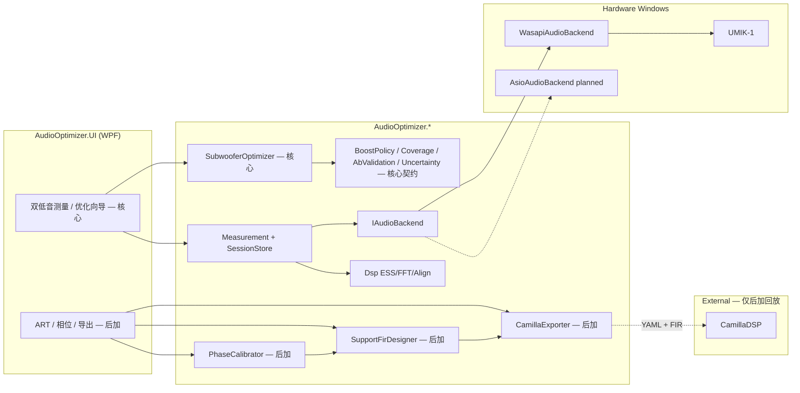
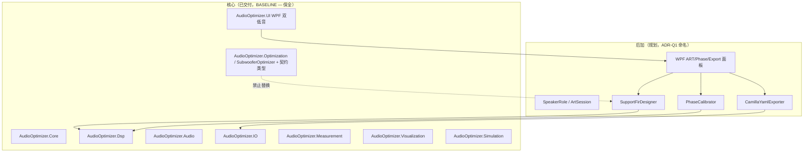
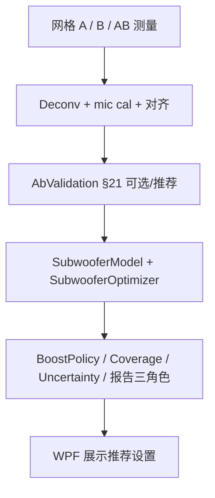
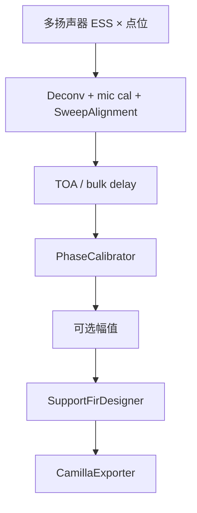
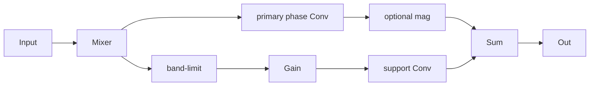

# Design Specification — RoomForge 核心 + 后加功能轨

**Document ID:** `SPEC-DES-001`  
**Version:** 2.1  
**Date:** 2026-10-01 (CST)  
**Status:** Approved for implementation（v2.1 framing：核心优先）  
**Implements:** [`requirements.md`](requirements.md)  
**Tasks:** [`tasks.md`](tasks.md)  
**Baseline:** [`../research/roomforge-baseline.md`](../research/roomforge-baseline.md)

---

## 1. Goals & Design Principles

1. **核心身份不可改写：** RoomForge 是已交付的 **双低音听音区空间均匀性优化器**；测量/DSP/WPF 是其管线，不是「等待 ART 的空壳」。
2. **Evolve, don't rewrite：** 一切设计以 ModerRAS/RoomForge 既有分层为地板；禁止平行再建测量/FFT/UI。
3. **后加 ≠ 第二对等产品：** ART / 相位 / Camilla 以 **加性 Extension** 引入；文档与模块图中核心在前、后加在后。
4. **不得替换 `SubwooferOptimizer`：** 后加求解器独立；可共享工具类型，不可偷换双低音实现。
5. **契约非回归门禁：** ProductSafety 3 dB、硬拒绝、Coverage 警告、§21、BoostRoles/L10、0.5 dB 裕量、Simulation/ProductContract — 后加不得削弱。
6. **Camilla is optional runtime（后加）：** 仅导出；核心双低音路径 **不**依赖 Camilla。
7. **No proprietary runtime deps：** 禁止 REW / A1 / Dirac SDK。
8. **WPF owns UX（P0）：** 扩展 `AudioOptimizer.UI`；后加面板并列，不拆除双低音入口。
9. **Windows-first：** WASAPI 已交付；ASIO 为第二后端；Linux/ALSA 非 P0。
10. **GPL-3.0**；版本化产物字段（后加导出另有 `export_version` / `phase_cal_version`）。

---

## 2. High-Level Architecture

### 2.1 Runtime Context



**边界**
- **核心路径：** 测量 → 双低音优化 → 契约报告；**不经过** Camilla。
- **后加路径：** 测量（可扩展角色）→ 相位 → support FIR → Camilla 导出；用户可选。
- **测量时** RoomForge 独占设备；**后加校正回放时** Camilla 占用。

### 2.2 Existing vs Extension Modules



### 2.3 Suggested New Projects（开放 ADR-Q1）

| 候选项目名 | 职责 | 依赖 |
|------------|------|------|
| `AudioOptimizer.Art` | 后加：角色、相位编排、support FIR、预览 DTO | Core, Dsp |
| `AudioOptimizer.Camilla` 或 `.Export` | 后加：YAML、FIR、校验、bypass | Core, Art, IO |
| （可选）`AudioOptimizer.Phase` | 若希望相位与 Art 解耦 | Core, Dsp |

**推荐默认：** Art + Camilla 两项目；**不要** Rust `artcam`。  
**硬规则：** `AudioOptimizer.Optimization`（双低音）**保留且不被 Art 替代**。

### 2.4 Dependency Rules

| From → To | Allowed? | Rule |
|-----------|----------|------|
| Art / Camilla → Audio | **No** | 优化/导出纯数据 |
| Art / Camilla → UI | **No** | UI 单向 |
| Art → Optimization（替换 SubwooferOptimizer） | **No** | 核心保全 |
| Measurement → Audio | Yes | 既有 |
| UI → Art / Camilla / Optimization | Yes | 编排；双低音与后加入口并列 |
| * → Core / Dsp | Yes | |

---

## 3. Repository Layout（演进后）

```text
RoomForge/
├── AudioOptimizer.sln
├── LICENSE                         # GPL-3.0
├── src/
│   ├── AudioOptimizer.Core/
│   ├── AudioOptimizer.Dsp/
│   ├── AudioOptimizer.Audio/       # + AsioAudioBackend（后加相关）
│   ├── AudioOptimizer.IO/
│   ├── AudioOptimizer.Measurement/ # + 多扬声器编排 gap-fill（后加）
│   ├── AudioOptimizer.Optimization/# 核心：Subwoofer* + BoostPolicy + … — 保全
│   ├── AudioOptimizer.Art/         # NEW 后加（建议）
│   ├── AudioOptimizer.Camilla/     # NEW 后加（建议）
│   ├── AudioOptimizer.Simulation/  # + 后加 fixtures；核心 regression 保留
│   ├── AudioOptimizer.Visualization/
│   └── AudioOptimizer.UI/          # 核心向导保留 + 后加面板
├── tests/AudioOptimizer.Tests/     # ProductContract 等核心测试不得删
└── .github/workflows/ci.yml
```

本工作区 `/workspace/art-camilladsp-tool/` **仅规格与研究**，不是实现仓库。

---

## 4. Tech Stack（继承）

| Layer | Choice | Notes |
|-------|--------|-------|
| Language | C# / .NET 10 | 继承 |
| UI P0 | WPF | 核心 + 后加扩展 |
| Audio | WASAPI 已交付；ASIO 计划 | |
| DSP | 既有 Fft/ESS/Farina | 后加扩展相位工具 |
| Core optimize | `SubwooferOptimizer` 等 | **产品心脏** |
| Export（后加） | Camilla YAML | 可选路径 |
| Test | xUnit + Simulation + ProductContract | |
| Out of P0 | Rust、ALSA、egui、WebUI | |

---

## 5. 核心数据与契约（已交付 — 设计承认）

实现以 upstream 为准；此处仅索引，**不**重新设计：

| 类型 / 模块 | 职责 |
|-------------|------|
| `SubMode` A/B/AB | 网格三模式会话 |
| `SubwooferModel` | \(H_A + G\cdot\mathrm{pol}\cdot e^{j\phi}\cdot\mathrm{delay}(H_B)\) |
| `SubwooferOptimizer` | 仅搜 B；分阶 + joint gain×phase；硬 boost 门 |
| `ObjectiveFunction` | level-invariant 分数；`LevelChangeDb` 外置 |
| `BoostPolicy` / `OptimizerOperatingMode` | ProductSafety ≤ 3.0；Capability 诊断 |
| `BoostRoles` | theoretical / legal / final |
| `MeasurementCoverage` | 无外推；中文警告常量 |
| `AbValidation` | §21 叠加校验 |
| `RecommendationUncertaintyPolicy` | 固定 0.5 dB 裕量 |

UI：`OptimizerPanelViewModel` 闭合选项 {0,3,6}，ProductSafety 路径钳制有效上限。

---

## 6. 后加数据模型（草图）

```csharp
namespace AudioOptimizer.Core; // 或 AudioOptimizer.Art

public enum SpeakerRole
{
    Unassigned = 0,
    Primary = 1,
    Support = 2,
    // 双低音 A/B 继续用独立模型；不必强制映射
}

public sealed record ArtChannelConfig(
    string ChannelId,
    SpeakerRole Role,
    int? HardwareOutputIndex);

public sealed class PhaseCalibrationOptions
{
    public double MaxPreRingMs { get; init; } = 2.0;
    public double MaxPreRingDb { get; init; } = -40;
    public double ModelingDelayMs { get; init; }
    public string Decomposition { get; init; } = "CepstralMinPhase";
    public bool ApplyToSupports { get; init; } = false; // P1 default off
}

public sealed class SupportOptimizationOptions
{
    public string PrimaryChannelId { get; init; } = "";
    public IReadOnlyList<string> SupportChannelIds { get; init; } = [];
    public double BandLowHz { get; init; } = 20;
    public double BandHighHz { get; init; } = 150;
    public double SupportLevelMaxDb { get; init; } = -6;
    public int FirLength { get; init; }
    public double Regularization { get; init; }
}

public sealed class PhaseCalibrationResult
{
    public string ChannelId { get; init; } = "";
    public double[] PhaseFir { get; init; } = [];
    public string PhaseCalVersion { get; init; } = "1";
}

public sealed class SupportOptimizationResult
{
    public string OptimizerVersion { get; init; } = "art-p0";
    public IReadOnlyDictionary<string, double[]> SupportFirs { get; init; }
        = new Dictionary<string, double[]>();
    public double BandLowHz { get; init; }
    public double BandHighHz { get; init; }
    public double SupportLevelDb { get; init; }
    public PhaseCalibrationResult? PrimaryPhase { get; init; }
}
```

**与核心：** `DualSubMeasurement` / `SubwooferSetting` **保持不变**；UI **分轨**（ADR-Q4 默认倾向）。

---

## 7. Pipelines

### 7.1 核心管线（已交付）



### 7.2 后加管线（规划）



顺序：`测量 → 对齐 → 【相位】→ 幅值 → Support → Camilla`；相位与 support 可分离开关。  
**旁路：** 用户可完全不进入后加管线，仅使用 §7.1。

---

## 8. Phase Calibrator（后加算法草图）

1. 分解 \(H=|H|e^{j\phi_{\min}}e^{j\phi_{\mathrm{excess}}}\)（Hilbert 或 cepstral，锁定一种）。
2. 多测点共有 excess；禁止单点无约束全逆为默认。
3. 预振铃约束下混合相位 FIR → Camilla Conv。
4. 对照：纯 min-phase 幅值 EQ 不得通过同一 excess 指标。
5. Primary 在非 bypass 导出中强制非空相位 FIR。

细节见 `../research/dirac-phase-calibration.md`。

---

## 9. Support FIR Designer（后加 P0）

- 输入：相位预条件化多点 IR + options。
- 输出：support FIR + band-limit + level；正则约束。
- P0：频域加权 LS / 带约束；P2：更完整 MIMO。
- **不得**把 `SubwooferOptimizer` 当作 ART 实现（可共享无关工具类型若合适）。

---

## 10. Camilla Export（后加）

### 10.1 目录示例

```text
export/<stamp>/
  camilla.yml
  fir/
    phase_L.wav
    support_L_from_R.wav
  manifest.json
  README.txt
```

### 10.2 逻辑图



Bypass：phase-bypass ⊥ support-bypass。写出前校验失败则不宣称成功。

---

## 11. Audio Backend Evolution

| 后端 | 状态 | 要点 |
|------|------|------|
| WasapiAudioBackend | **已交付（核心测量）** | 保持 |
| AsioAudioBackend | **计划（后加多通道友好）** | 实现 IAudioBackend |
| VirtualAudioBackend | Simulation | 核心 + 后加回归 |

**ADR-Q2：** 后加 ART 演示是否必须先 ASIO，或允许 WASAPI 串行 + 限制文档。

---

## 12. UI Extension（WPF）

| 面板 | 归属 |
|------|------|
| 测量向导（双低音 A/B/AB） | **核心 — 保留** |
| 双低音优化面板 | **核心 — 保留**（ProductSafety 钳制） |
| 多通道角色标注 | 后加扩展 |
| 相位校准 / ART / Camilla 导出 | **后加 — 新面板** |
| Debug FIR scaffold | flag only |

文案中文优先。文档与导航：**核心说明在前，后加在后**。

---

## 13. Testing Strategy

| 层 | 做法 |
|----|------|
| 核心契约 | **保留** ProductContract、BoostPolicy、Coverage、Uncertainty、UI ProductSafety、AbValidation、Simulation quick |
| 后加单元 | 相位分解、共有 excess、FIR、YAML、旁路独立性 |
| 金样 | mixed-phase vs pure mag EQ |
| CI | windows-latest + dotnet 10；无物理声卡依赖 |
| 门禁 | 任何后加 PR：核心测试必须绿 |

---

## 14. Open Decisions（ADR）

| ID | 问题 | 默认倾向（非锁定） |
|----|------|-------------------|
| ADR-Q1 | Art/Camilla 项目切分 | Art + Camilla |
| ADR-Q2 | ART 演示是否必须 ASIO | 尽快 ASIO；演示可暂 WASAPI |
| ADR-Q3 | 默认采样率 | **48 kHz** |
| ADR-Q4 | 双低音 UI vs primary/support | **分轨保留**核心 UI |
| ADR-Q5 | FIR Wav vs Raw | Wav（既有 WavFile） |
| ADR-Q6 | YAML 库 | 核验 GPL 兼容 |
| ADR-Q7 | P2 WebUI / Linux | 默认不做 |

---

## 15. Risks & Mitigations

| Risk | Mitigation |
|------|------------|
| 规格把 ART 写成与核心对等 | v2.1 framing；README/REQ 开篇核心 |
| 后加破坏 ProductSafety / Coverage | NFR-10；CI 门禁；禁止改契约常量无 ADR |
| 误建 greenfield Rust | baseline + 取消任务清单 |
| WASAPI 不够多通道 | ASIO；ADR-Q2 |
| GPL 与 NuGet | 引入前审查 |

---

## 16. Mapping from v1.1 / v2.0 labels

| 旧说法 | v2.1 |
|--------|------|
| Product A | **核心产品（已交付）** 双低音 |
| Product B / ART track | **后加功能轨（规划）** |
| v1.1 Rust crates | 见 v2.0 映射表精神：落到既有 C# 项目；optimize≠替换双低音 |
| `artcam` | **不使用** |

---

*End of design.md · v2.1*
